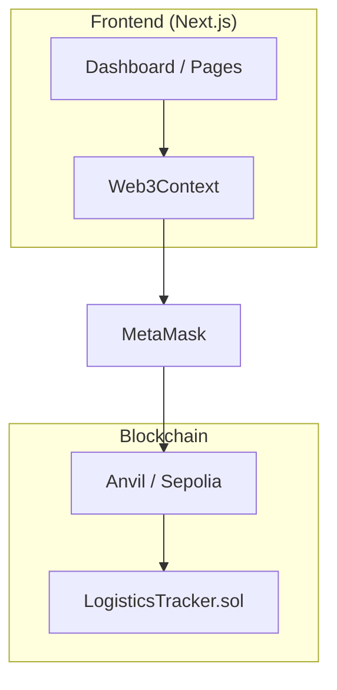
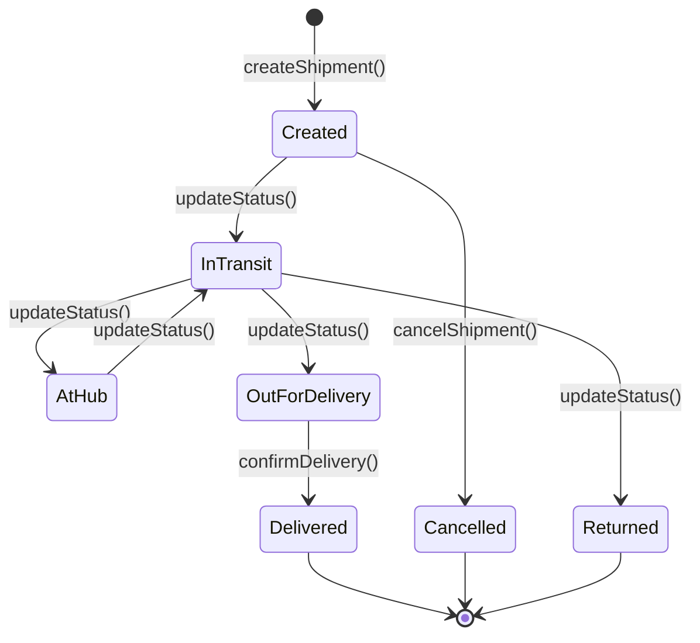
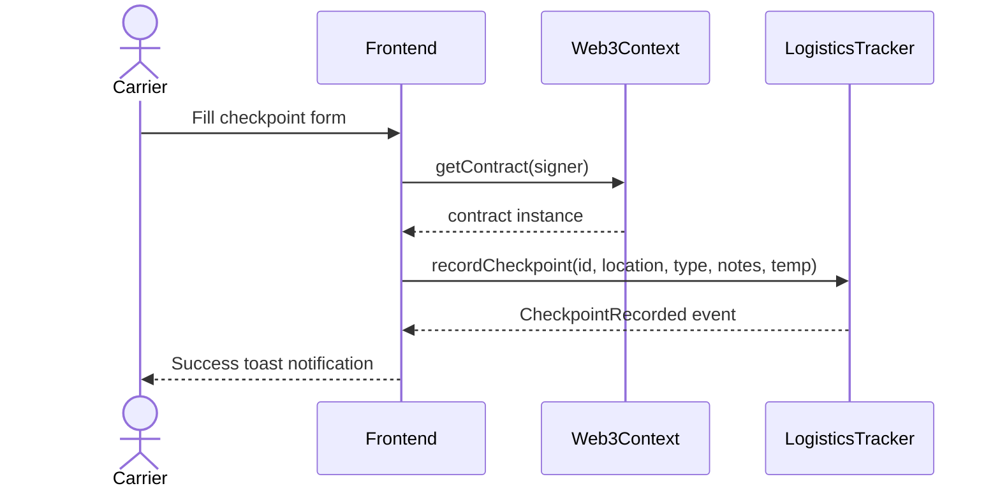
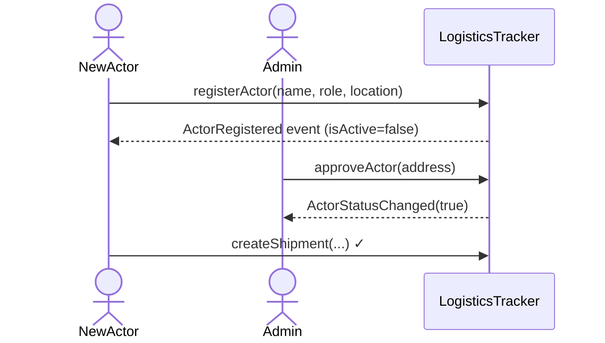
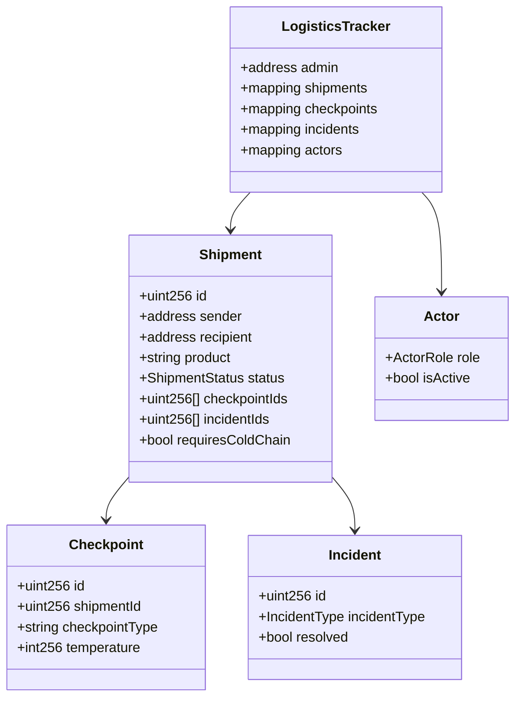

# Implementation Plan — Supply Chain Tracker Logistics (GloboSend Express)

> Step-by-step guide to scaffold, initialize, and build the project from an empty directory to a Sepolia-deployed, submission-ready DApp.  
> Read `plans/requirements.md`, `plans/use-cases-definition.md`, and `plans/architecture.md` before starting.

---

## Prerequisites Verification

```bash
node --version    # must be 20+
npm --version     # must be 10+
git --version     # any
forge --version   # Foundry installed
anvil --version   # bundled with Foundry
cast --version    # bundled with Foundry
```

Install Foundry if missing:
```bash
curl -L https://foundry.paradigm.xyz | bash
foundryup
```

---

## Phase 1: Project Scaffold

### 1.1 Git + Root Structure

```bash
cd supply_chain_tracker_logistics
git init

# Root directories
mkdir -p sc/src sc/script sc/test
mkdir -p web   # will be replaced by create-next-app
mkdir -p mcp-server/src
mkdir -p docs screenshots
# plans/ already exists

# .gitignore
cat > .gitignore << 'EOF'
# Foundry artifacts
sc/out/
sc/cache/
sc/broadcast/
sc/.env

# Node
web/node_modules/
web/.next/
web/.env
web/.env.local
mcp-server/node_modules/
mcp-server/dist/

# Env files (never commit secrets)
.env
*.env.local
*.env.production

# OS
.DS_Store
Thumbs.db
EOF

# MIT License
cat > LICENSE << 'EOF'
MIT License

Copyright (c) 2025 [Your Name]

Permission is hereby granted, free of charge, to any person obtaining a copy
of this software and associated documentation files (the "Software"), to deal
in the Software without restriction, including without limitation the rights
to use, copy, modify, merge, publish, distribute, sublicense, and/or sell
copies of the Software, and to permit persons to whom the Software is
furnished to do so, subject to the following conditions:

The above copyright notice and this permission notice shall be included in all
copies or substantial portions of the Software.

THE SOFTWARE IS PROVIDED "AS IS", WITHOUT WARRANTY OF ANY KIND, EXPRESS OR
IMPLIED, INCLUDING BUT NOT LIMITED TO THE WARRANTIES OF MERCHANTABILITY,
FITNESS FOR A PARTICULAR PURPOSE AND NONINFRINGEMENT. IN NO EVENT SHALL THE
AUTHORS OR COPYRIGHT HOLDERS BE LIABLE FOR ANY CLAIM, DAMAGES OR OTHER
LIABILITY, WHETHER IN AN ACTION OF CONTRACT, TORT OR OTHERWISE, ARISING FROM,
OUT OF OR IN CONNECTION WITH THE SOFTWARE OR THE USE OR OTHER DEALINGS IN THE
SOFTWARE.
EOF

git add .gitignore LICENSE
git commit -m "chore: initial project scaffold with gitignore and license"
```

---

## Phase 2: Smart Contract (sc/)

### 2.1 Initialize Foundry

```bash
cd sc
forge init --no-git .
# Remove default files
rm -f src/Counter.sol test/Counter.t.sol script/Counter.s.sol
```

**`sc/foundry.toml`:**
```toml
[profile.default]
src = "src"
out = "out"
libs = ["lib"]
solc = "0.8.20"
optimizer = true
optimizer_runs = 200
via_ir = false

[rpc_endpoints]
anvil   = "http://localhost:8545"
sepolia = "${SEPOLIA_RPC_URL}"

[etherscan]
sepolia = { key = "${ETHERSCAN_API_KEY}", url = "https://api-sepolia.etherscan.io/api" }
```

### 2.2 Write LogisticsTracker.sol

**`sc/src/LogisticsTracker.sol`** — full contract structure:

```solidity
// SPDX-License-Identifier: MIT
pragma solidity ^0.8.20;

/// @title LogisticsTracker — GloboSend Express on-chain shipment tracker
/// @notice Tracks courier-style shipments via checkpoints, incidents, and digital delivery confirmation
contract LogisticsTracker {

    // ─── Enums ───────────────────────────────────────────────────────────────

    enum ShipmentStatus { Created, InTransit, AtHub, OutForDelivery, Delivered, Returned, Cancelled }
    enum ActorRole      { None, Sender, Carrier, Hub, Recipient, Inspector }
    enum IncidentType   { Delay, Damage, Lost, TempViolation, Unauthorized }

    // ─── Structs ──────────────────────────────────────────────────────────────

    struct Actor {
        address actorAddress;
        string  name;
        ActorRole role;
        string  location;
        bool    isActive;
    }

    struct Shipment {
        uint256 id;
        address sender;
        address recipient;
        string  product;
        string  origin;
        string  destination;
        uint256 dateCreated;
        uint256 dateDelivered;
        ShipmentStatus status;
        uint256[] checkpointIds;
        uint256[] incidentIds;
        bool    requiresColdChain;
    }

    struct Checkpoint {
        uint256 id;
        uint256 shipmentId;
        address actor;
        string  location;
        string  checkpointType; // "Pickup" | "Hub" | "Transit" | "Delivery"
        uint256 timestamp;
        string  notes;
        int256  temperature;    // celsius × 10; 0 means not recorded
    }

    struct Incident {
        uint256 id;
        uint256 shipmentId;
        IncidentType incidentType;
        address reporter;
        string  description;
        uint256 timestamp;
        bool    resolved;
    }

    // ─── State ────────────────────────────────────────────────────────────────

    address public admin;
    uint256 public nextShipmentId  = 1;
    uint256 public nextCheckpointId = 1;
    uint256 public nextIncidentId  = 1;

    mapping(uint256 => Shipment)   public shipments;
    mapping(uint256 => Checkpoint) public checkpoints;
    mapping(uint256 => Incident)   public incidents;
    mapping(address => Actor)      public actors;
    mapping(address => uint256[])  internal _actorShipments;

    // ─── Events ───────────────────────────────────────────────────────────────

    event ShipmentCreated(uint256 indexed shipmentId, address indexed sender, address indexed recipient, string product);
    event CheckpointRecorded(uint256 indexed checkpointId, uint256 indexed shipmentId, string location, address actor);
    event ShipmentStatusChanged(uint256 indexed shipmentId, ShipmentStatus newStatus);
    event IncidentReported(uint256 indexed incidentId, uint256 indexed shipmentId, IncidentType incidentType);
    event IncidentResolved(uint256 indexed incidentId);
    event DeliveryConfirmed(uint256 indexed shipmentId, address indexed recipient, uint256 timestamp);
    event ActorRegistered(address indexed actorAddress, string name, ActorRole role);
    event ActorStatusChanged(address indexed actorAddress, bool isActive);

    // ─── Modifiers ────────────────────────────────────────────────────────────

    modifier onlyAdmin() {
        require(msg.sender == admin, "Not admin");
        _;
    }

    modifier onlyActiveActor() {
        require(actors[msg.sender].isActive, "Actor not active");
        _;
    }

    // ─── Constructor ──────────────────────────────────────────────────────────

    constructor() {
        admin = msg.sender;
    }

    // ─── Actor Management ─────────────────────────────────────────────────────

    /// @notice Register as an actor in the system. Awaits admin approval.
    /// @param _name Display name of the company/individual
    /// @param _role Desired role (Sender, Carrier, Hub, Recipient, Inspector)
    /// @param _location Physical location description
    function registerActor(string memory _name, ActorRole _role, string memory _location) external {
        require(_role != ActorRole.None, "Invalid role");
        require(actors[msg.sender].actorAddress == address(0), "Already registered");
        actors[msg.sender] = Actor(msg.sender, _name, _role, _location, false);
        emit ActorRegistered(msg.sender, _name, _role);
    }

    /// @notice Approve an actor (admin only)
    /// @param _actor Address to approve
    function approveActor(address _actor) external onlyAdmin {
        require(actors[_actor].actorAddress != address(0), "Not registered");
        actors[_actor].isActive = true;
        emit ActorStatusChanged(_actor, true);
    }

    /// @notice Deactivate an actor (admin only)
    /// @param _actor Address to deactivate
    function deactivateActor(address _actor) external onlyAdmin {
        actors[_actor].isActive = false;
        emit ActorStatusChanged(_actor, false);
    }

    /// @notice Get actor info
    /// @param _actor Address to query
    /// @return Actor struct
    function getActor(address _actor) external view returns (Actor memory) {
        return actors[_actor];
    }

    // ─── Shipment Management ─────────────────────────────────────────────────

    /// @notice Create a new shipment (Sender role only)
    /// @param _recipient Recipient wallet address
    /// @param _product Product description
    /// @param _origin Origin location
    /// @param _destination Destination location
    /// @param _requiresColdChain Whether temperature monitoring is required
    /// @return shipmentId The ID of the newly created shipment
    function createShipment(
        address _recipient,
        string memory _product,
        string memory _origin,
        string memory _destination,
        bool _requiresColdChain
    ) external onlyActiveActor returns (uint256) {
        require(actors[msg.sender].role == ActorRole.Sender, "Must be Sender");
        require(_recipient != address(0), "Invalid recipient");

        uint256 id = nextShipmentId++;
        Shipment storage s = shipments[id];
        s.id = id;
        s.sender = msg.sender;
        s.recipient = _recipient;
        s.product = _product;
        s.origin = _origin;
        s.destination = _destination;
        s.dateCreated = block.timestamp;
        s.status = ShipmentStatus.Created;
        s.requiresColdChain = _requiresColdChain;

        _actorShipments[msg.sender].push(id);
        _actorShipments[_recipient].push(id);

        emit ShipmentCreated(id, msg.sender, _recipient, _product);
        return id;
    }

    /// @notice Get shipment details
    function getShipment(uint256 _shipmentId) external view returns (
        uint256, address, address, string memory, string memory, string memory,
        uint256, uint256, ShipmentStatus, bool
    ) {
        Shipment storage s = shipments[_shipmentId];
        return (s.id, s.sender, s.recipient, s.product, s.origin, s.destination,
                s.dateCreated, s.dateDelivered, s.status, s.requiresColdChain);
    }

    /// @notice Update shipment status
    function updateShipmentStatus(uint256 _shipmentId, ShipmentStatus _newStatus) external onlyActiveActor {
        ShipmentStatus current = shipments[_shipmentId].status;
        require(current != ShipmentStatus.Delivered && current != ShipmentStatus.Cancelled, "Terminal status");
        shipments[_shipmentId].status = _newStatus;
        emit ShipmentStatusChanged(_shipmentId, _newStatus);
    }

    /// @notice Recipient confirms delivery (digital confirmation on-chain)
    function confirmDelivery(uint256 _shipmentId) external onlyActiveActor {
        Shipment storage s = shipments[_shipmentId];
        require(msg.sender == s.recipient, "Not recipient");
        require(s.status != ShipmentStatus.Delivered, "Already delivered");
        s.status = ShipmentStatus.Delivered;
        s.dateDelivered = block.timestamp;
        emit ShipmentStatusChanged(_shipmentId, ShipmentStatus.Delivered);
        emit DeliveryConfirmed(_shipmentId, msg.sender, block.timestamp);
    }

    /// @notice Cancel a shipment (sender only)
    function cancelShipment(uint256 _shipmentId) external onlyActiveActor {
        Shipment storage s = shipments[_shipmentId];
        require(msg.sender == s.sender, "Not sender");
        require(s.status != ShipmentStatus.Delivered, "Already delivered");
        s.status = ShipmentStatus.Cancelled;
        emit ShipmentStatusChanged(_shipmentId, ShipmentStatus.Cancelled);
    }

    // ─── Checkpoint Management ────────────────────────────────────────────────

    /// @notice Record a checkpoint for a shipment
    /// @param _shipmentId Shipment to record for
    /// @param _location Location description
    /// @param _checkpointType "Pickup" | "Hub" | "Transit" | "Delivery"
    /// @param _notes Free-text notes
    /// @param _temperature Temperature in celsius × 10 (0 if not applicable)
    /// @return checkpointId
    function recordCheckpoint(
        uint256 _shipmentId,
        string memory _location,
        string memory _checkpointType,
        string memory _notes,
        int256 _temperature
    ) external onlyActiveActor returns (uint256) {
        require(shipments[_shipmentId].id != 0, "Shipment not found");

        uint256 id = nextCheckpointId++;
        checkpoints[id] = Checkpoint(id, _shipmentId, msg.sender, _location, _checkpointType, block.timestamp, _notes, _temperature);
        shipments[_shipmentId].checkpointIds.push(id);

        emit CheckpointRecorded(id, _shipmentId, _location, msg.sender);
        return id;
    }

    /// @notice Get a single checkpoint
    function getCheckpoint(uint256 _checkpointId) external view returns (Checkpoint memory) {
        return checkpoints[_checkpointId];
    }

    /// @notice Get all checkpoints for a shipment
    function getShipmentCheckpoints(uint256 _shipmentId) external view returns (Checkpoint[] memory) {
        uint256[] storage ids = shipments[_shipmentId].checkpointIds;
        Checkpoint[] memory result = new Checkpoint[](ids.length);
        for (uint256 i = 0; i < ids.length; i++) {
            result[i] = checkpoints[ids[i]];
        }
        return result;
    }

    // ─── Incident Management ──────────────────────────────────────────────────

    /// @notice Report an incident on a shipment
    function reportIncident(
        uint256 _shipmentId,
        IncidentType _incidentType,
        string memory _description
    ) external onlyActiveActor returns (uint256) {
        require(shipments[_shipmentId].id != 0, "Shipment not found");

        uint256 id = nextIncidentId++;
        incidents[id] = Incident(id, _shipmentId, _incidentType, msg.sender, _description, block.timestamp, false);
        shipments[_shipmentId].incidentIds.push(id);

        emit IncidentReported(id, _shipmentId, _incidentType);
        return id;
    }

    /// @notice Resolve an incident (admin or original reporter)
    function resolveIncident(uint256 _incidentId) external {
        Incident storage inc = incidents[_incidentId];
        require(!inc.resolved, "Already resolved");
        require(msg.sender == admin || msg.sender == inc.reporter, "Not authorized");
        inc.resolved = true;
        emit IncidentResolved(_incidentId);
    }

    /// @notice Get a single incident
    function getIncident(uint256 _incidentId) external view returns (Incident memory) {
        return incidents[_incidentId];
    }

    /// @notice Get all incidents for a shipment
    function getShipmentIncidents(uint256 _shipmentId) external view returns (Incident[] memory) {
        uint256[] storage ids = shipments[_shipmentId].incidentIds;
        Incident[] memory result = new Incident[](ids.length);
        for (uint256 i = 0; i < ids.length; i++) {
            result[i] = incidents[ids[i]];
        }
        return result;
    }

    // ─── Auxiliary ────────────────────────────────────────────────────────────

    /// @notice Get all shipment IDs involving an actor (as sender or recipient)
    function getActorShipments(address _actor) external view returns (uint256[] memory) {
        return _actorShipments[_actor];
    }

    /// @notice Check if all checkpoints with temperature readings are within a reasonable range
    /// @dev Returns false if any TempViolation incident exists for this shipment
    function verifyTemperatureCompliance(uint256 _shipmentId) external view returns (bool) {
        uint256[] storage incidentIds = shipments[_shipmentId].incidentIds;
        for (uint256 i = 0; i < incidentIds.length; i++) {
            if (incidents[incidentIds[i]].incidentType == IncidentType.TempViolation) {
                return false;
            }
        }
        return true;
    }
}
```

### 2.3 Deploy Script

**`sc/script/Deploy.s.sol`:**
```solidity
// SPDX-License-Identifier: MIT
pragma solidity ^0.8.20;
import "forge-std/Script.sol";
import "../src/LogisticsTracker.sol";

contract Deploy is Script {
    function run() external returns (address) {
        uint256 deployerKey = vm.envUint("PRIVATE_KEY");
        vm.startBroadcast(deployerKey);
        LogisticsTracker tracker = new LogisticsTracker();
        console.log("LogisticsTracker deployed at:", address(tracker));
        vm.stopBroadcast();
        return address(tracker);
    }
}
```

**`sc/.env.example`** (committed):
```
PRIVATE_KEY=0x_your_private_key_here
SEPOLIA_RPC_URL=https://sepolia.infura.io/v3/YOUR_KEY
ETHERSCAN_API_KEY=YOUR_ETHERSCAN_KEY
```

### 2.4 Test File Structure

**`sc/test/LogisticsTracker.t.sol`** — key patterns:

```solidity
// SPDX-License-Identifier: MIT
pragma solidity ^0.8.20;
import "forge-std/Test.sol";
import "../src/LogisticsTracker.sol";

contract LogisticsTrackingTest is Test {
    LogisticsTracker tracker;

    address admin     = address(this);
    address sender1   = makeAddr("TechCorp");
    address carrier1  = makeAddr("ExpressRide");
    address hub1      = makeAddr("HubMadrid");
    address recip1    = makeAddr("StartupInnovations");
    address inspector = makeAddr("QCInspector");

    function setUp() public {
        tracker = new LogisticsTracker();
        _registerAndApprove(sender1,  LogisticsTracker.ActorRole.Sender,    "Madrid");
        _registerAndApprove(carrier1, LogisticsTracker.ActorRole.Carrier,   "Madrid");
        _registerAndApprove(hub1,     LogisticsTracker.ActorRole.Hub,       "Getafe");
        _registerAndApprove(recip1,   LogisticsTracker.ActorRole.Recipient, "Barcelona");
        _registerAndApprove(inspector,LogisticsTracker.ActorRole.Inspector, "Madrid");
    }

    function _registerAndApprove(address actor, LogisticsTracker.ActorRole role, string memory loc) internal {
        vm.prank(actor);
        tracker.registerActor("TestActor", role, loc);
        tracker.approveActor(actor);
    }

    // Example event test:
    function testShipmentCreatedEvent() public {
        vm.expectEmit(true, true, true, true);
        emit LogisticsTracker.ShipmentCreated(1, sender1, recip1, "Laptops");
        vm.prank(sender1);
        tracker.createShipment(recip1, "Laptops", "Madrid", "Barcelona", false);
    }

    // Example full flow test:
    function testCompleteShippingFlow() public {
        // 1. Create
        vm.prank(sender1);
        uint256 id = tracker.createShipment(recip1, "Laptops", "Madrid", "Barcelona", false);

        // 2. Carrier picks up
        vm.prank(carrier1);
        tracker.recordCheckpoint(id, "TechCorp warehouse", "Pickup", "Sealed", 0);
        vm.prank(carrier1);
        tracker.updateShipmentStatus(id, LogisticsTracker.ShipmentStatus.InTransit);

        // 3. Hub receives
        vm.prank(hub1);
        tracker.recordCheckpoint(id, "Hub Madrid", "Hub", "Sorted", 0);

        // 4. Deliver
        vm.prank(carrier1);
        tracker.recordCheckpoint(id, "Barcelona Tech Campus", "Delivery", "Delivered to reception", 0);
        vm.prank(carrier1);
        tracker.updateShipmentStatus(id, LogisticsTracker.ShipmentStatus.OutForDelivery);

        // 5. Recipient confirms
        vm.prank(recip1);
        tracker.confirmDelivery(id);

        // 6. Verify
        (,,,,,,, uint256 dateDelivered, LogisticsTracker.ShipmentStatus status,) = tracker.getShipment(id);
        assertEq(uint8(status), uint8(LogisticsTracker.ShipmentStatus.Delivered));
        assertGt(dateDelivered, 0);
    }

    // ... all tests from requirements.md A.9
}
```

### 2.5 Build & Test Gate

```bash
cd sc
forge build           # zero errors required
forge test            # all tests green
forge coverage        # aim for > 80%
forge snapshot        # gas benchmarks (optional O9)
```

Commit after green:
```bash
git add sc/
git commit -m "feat: implement LogisticsTracker smart contract with full test suite"
```

---

## Phase 3: Frontend (web/)

### 3.1 Initialize

```bash
cd ..  # project root
npx create-next-app@latest web \
  --typescript \
  --tailwind \
  --eslint \
  --app \
  --src-dir \
  --import-alias "@/*" \
  --no-git

cd web
npm install ethers@6 qrcode.react recharts leaflet react-leaflet
npm install -D @types/leaflet

# shadcn/ui
npx shadcn-ui@latest init
# Choose: Default style, Slate color, CSS variables: yes
npx shadcn-ui@latest add button card select label badge input table dialog toast separator
```

### 3.2 Copy ABI

```bash
# After forge build:
cp sc/out/LogisticsTracker.sol/LogisticsTracker.json web/src/contracts/
```

### 3.3 Environment Files

**`web/.env.local`** (never committed):
```
NEXT_PUBLIC_CONTRACT_ADDRESS=0x5FbDB2315678afecb367f032d93F642f64180aa3
NEXT_PUBLIC_ADMIN_ADDRESS=0xf39Fd6e51aad88F6F4ce6aB8827279cffFb92266
NEXT_PUBLIC_SEPOLIA_RPC=https://sepolia.infura.io/v3/YOUR_KEY
ANTHROPIC_API_KEY=sk-ant-...
```

**`web/.env.example`** (committed):
```
NEXT_PUBLIC_CONTRACT_ADDRESS=0x_your_deployed_contract_address
NEXT_PUBLIC_ADMIN_ADDRESS=0x_your_admin_wallet_address
NEXT_PUBLIC_SEPOLIA_RPC=https://sepolia.infura.io/v3/YOUR_INFURA_KEY
ANTHROPIC_API_KEY=sk-ant-your-api-key
```

### 3.4 Web3 Infrastructure Files

**`web/src/contracts/config.ts`:**
```typescript
import LogisticsTrackerABI from './LogisticsTracker.json';

export const CONTRACT_CONFIG = {
  address: process.env.NEXT_PUBLIC_CONTRACT_ADDRESS as `0x${string}`,
  abi: LogisticsTrackerABI.abi,
  adminAddress: process.env.NEXT_PUBLIC_ADMIN_ADDRESS as `0x${string}`,
};

export const NETWORK_CONFIG = {
  anvil:   { chainId: 31337,    name: 'Anvil Local',    rpcUrl: 'http://localhost:8545', symbol: 'ETH' },
  sepolia: { chainId: 11155111, name: 'Sepolia Testnet', rpcUrl: process.env.NEXT_PUBLIC_SEPOLIA_RPC!, symbol: 'ETH' },
};

export const SUPPORTED_CHAIN_IDS = [31337, 11155111];
```

**`web/src/lib/web3.ts`:** helper functions:
- `getProvider()` → `new ethers.BrowserProvider(window.ethereum)`
- `getContract(signer?)` → typed contract instance using ABI + address
- `bigIntToDate(n: bigint)` → `new Date(Number(n) * 1000)`
- `tempToDisplay(t: bigint)` → `(Number(t) / 10).toFixed(1) + '°C'`
- `shortenAddress(addr: string)` → `addr.slice(0,6) + '...' + addr.slice(-4)`

**`web/src/contexts/Web3Context.tsx`:**
- State: `{ address, isConnected, chainId, actorInfo, isAdmin, isLoading }`
- `connect()`: `eth_requestAccounts` → `getActor(address)` → store in state + localStorage
- `disconnect()`: clear state + `localStorage.removeItem('lastConnectedAddress')`
- `useEffect` on mount: if `localStorage.lastConnectedAddress` exists → auto-reconnect
- Event listeners: `window.ethereum.on('accountsChanged', ...)` and `on('chainChanged', ...)`

**`web/src/hooks/useWallet.ts`:**
```typescript
export function useWallet() {
  return useContext(Web3Context);
}
```

### 3.5 Pages Implementation Order

Build pages in this order — each step builds on the previous:

**Step 1 — `app/layout.tsx` + `app/page.tsx`**
- Layout: `<Web3Provider>` wrapper + `<Header>`
- Landing page: conditional rendering based on connection state:
  - Not connected → "Connect MetaMask" hero
  - Connected, no actor → Registration form (name, role select, location)
  - Connected, `isActive=false` → "Pending approval" waiting screen
  - Connected, `isActive=true` → Welcome + link to dashboard

**Step 2 — `app/admin/` (build early to unblock actor testing)**
- `/admin/page.tsx`: pending actors list; Approve button → `approveActor(address)`
- `/admin/actors/page.tsx`: all actors table with Approve/Deactivate; uses `ActorTable.tsx`

**Step 3 — `app/dashboard/page.tsx`**
- Fetch actor's shipments via `getActorShipments(address)`
- Stats cards: active shipments count, pending incidents, delivered this week
- Quick action buttons based on role (Create Shipment for Senders; Record Checkpoint for Carriers/Hubs)
- Recent activity list

**Step 4 — `app/shipments/`**
- `page.tsx`: list with `ShipmentCard.tsx`; filter by status (optional O7)
- `create/page.tsx`: form with recipient address input, product, origin, destination, cold chain toggle; calls `createShipment`
- `[id]/page.tsx`: shipment header (status badge, route, dates) + `TrackingTimeline.tsx` + incidents section + confirm delivery button (recipient only, when status=OutForDelivery)

**Step 5 — `app/checkpoints/record/page.tsx`**
- Route guard: Carrier or Hub role only
- Form: shipment ID (or select from actor's active shipments), location, checkpoint type select, notes textarea, temperature input (conditional on cold chain flag)
- Calls `recordCheckpoint` + optionally `updateShipmentStatus`

**Step 6 — `app/incidents/page.tsx`**
- Tabs: "Open Incidents" / "Resolved"
- Report incident form (shipment ID, type select, description)
- Resolve button for admin and original reporter
- Uses `IncidentCard.tsx`

**Step 7 — `app/profile/page.tsx`**
- Actor info card (name, role badge, location, wallet address)
- List of all actor's shipments

### 3.6 Key Components

**`TrackingTimeline.tsx`** — most important component:
```tsx
// Vertical timeline; each checkpoint = a step node
// Current step: animated pulse dot
// Temperature violation: red node + warning icon
// Incidents: shown inline between relevant checkpoints
// Props:
//   checkpoints: Checkpoint[]
//   incidents: Incident[]
//   currentStatus: ShipmentStatus
```

**`Header.tsx`:**
```tsx
// Left: "GloboSend Express" logo + icon
// Center: nav links (role-filtered)
// Right: network badge + shortened address + disconnect button
// Mobile: hamburger menu
```

### 3.7 Build Gate

```bash
npm run build   # must pass with zero type errors
npm run lint    # must pass
```

Commit after passing:
```bash
git add web/
git commit -m "feat: implement frontend with Web3 integration and all pages"
```

---

## Phase 4: MCP Server (mcp-server/)

### 4.1 Initialize & Implement

```bash
cd mcp-server
npm init -y
npm install @modelcontextprotocol/sdk
npm install -D typescript @types/node
```

Implement `src/index.ts` following the full code in `plans/ai-mcp-strategy.md`.

```bash
npm run build   # compiles TypeScript to dist/
```

Add `.mcp.json` to project root (see `plans/ai-mcp-strategy.md`).

Commit:
```bash
git add mcp-server/ .mcp.json
git commit -m "feat: add Foundry MCP server wrapping forge/anvil/cast CLI"
```

---

## Phase 5: Seed Script (optional but recommended for demo)

**`sc/script/Seed.s.sol`** — sets up UC-01 through UC-05 in one run:

```solidity
// SPDX-License-Identifier: MIT
pragma solidity ^0.8.20;
import "forge-std/Script.sol";
import "../src/LogisticsTracker.sol";

contract Seed is Script {
    // Addresses from use-cases-definition.md
    address sender1   = 0x70997970C51812dc3A010C7d01b50e0d17dc79C8;
    address sender2   = 0x3C44CdDdB6a900fa2b585dd299e03d12FA4293BC;
    address carrier1  = 0x90F79bf6EB2c4f870365E785982E1f101E93b906;
    address hub1      = 0x9965507D1a55bcC2695C58ba16FB37d819B0A4dc;
    address hub2      = 0x976EA74026E726554dB657fA54763abd0C3a0aa9;
    address recip1    = 0x14dC79964da2C08b23698B3D3cc7Ca32193d9955;
    address recip2    = 0x23618e81E3f5cdF7f54C3d65f7FBc0aBf5B21E8f;
    address inspector = 0xa0Ee7A142d267C1f36714E4a8F75612F20a79720;

    function run() external {
        uint256 adminKey = vm.envUint("PRIVATE_KEY");
        vm.startBroadcast(adminKey);

        LogisticsTracker tracker = LogisticsTracker(vm.envAddress("CONTRACT_ADDRESS"));

        // Register + approve all actors
        // ... (register each actor with vm.prank, then approveActor)

        // Create UC-01: Standard delivery
        // ... (createShipment, recordCheckpoints, confirmDelivery)

        // Create UC-02: Cold chain delivery
        // ... (createShipment with requiresColdChain=true, recordCheckpoints with temps)

        // Create UC-03: Damaged package
        // ... (createShipment, recordCheckpoints, reportIncident, resolveIncident)

        // Create UC-04: Temperature violation
        // ... (createShipment, recordCheckpoints with violation, reportIncident)

        // Create UC-05: Express same-city
        // ... (createShipment, 2 checkpoints, confirmDelivery)

        vm.stopBroadcast();
    }
}
```

Run:
```bash
CONTRACT_ADDRESS=0x... forge script script/Seed.s.sol \
  --rpc-url http://localhost:8545 \
  --private-key 0xac0974... \
  --broadcast
```

---

## Phase 6: Documentation

### 6.1 docs/diagramas.md

Create 5 Mermaid diagrams:

```markdown
## 1. System Architecture



## 2. Shipment Lifecycle



## 3. Checkpoint Recording Sequence



## 4. Actor Registration Flow



## 5. Data Model


```

### 6.2 IA.md

Fill in the template from `plans/ai-mcp-strategy.md` Section 2 as development progresses.

### 6.3 README.md (project root)

Write after all other parts are done; include all sections from `plans/requirements.md` Part E.2.

### 6.4 Screenshots

Take 7 screenshots (see `plans/requirements.md` Part E.4) after frontend is complete. Save to `screenshots/` with descriptive names.

Commit:
```bash
git add docs/ IA.md README.md screenshots/
git commit -m "docs: add technical diagrams, IA.md, README, and screenshots"
```

---

## Phase 7: Testnet Deployment & Final Delivery

### 7.1 Deploy to Sepolia

```bash
cd sc

# Create sc/.env (do NOT commit)
echo "SEPOLIA_RPC_URL=https://sepolia.infura.io/v3/YOUR_KEY" >> .env
echo "PRIVATE_KEY=0x_your_key" >> .env
echo "ETHERSCAN_API_KEY=YOUR_KEY" >> .env

# Deploy + auto-verify on Etherscan
forge script script/Deploy.s.sol \
  --rpc-url $SEPOLIA_RPC_URL \
  --private-key $PRIVATE_KEY \
  --broadcast \
  --verify \
  --etherscan-api-key $ETHERSCAN_API_KEY

# Note the deployed address from output
```

### 7.2 Update Frontend for Sepolia

```bash
# web/.env.local
NEXT_PUBLIC_CONTRACT_ADDRESS=0x_sepolia_deployed_address
NEXT_PUBLIC_ADMIN_ADDRESS=0x_your_deployer_address

# Add Sepolia to MetaMask and test all flows
# Update README with contract address + Etherscan link
```

### 7.3 Demo Video Script (Loom, max 5 min)

| Time | Content |
|---|---|
| 0:00–0:30 | "GloboSend Express: blockchain-based courier tracking. Shows shipment journey from sender to recipient with on-chain checkpoints, digital delivery confirmation, and incident management." |
| 0:30–1:00 | Architecture diagram: Next.js → MetaMask → Sepolia → LogisticsTracker.sol |
| 1:00–1:30 | Show MCP server: "I can ask Claude to run forge tests directly." — demonstrate one tool call |
| 1:30–2:00 | Register actor, admin approves it |
| 2:00–3:00 | Create UC-01 shipment, record checkpoints, show DHL-style tracking timeline updating |
| 3:00–3:30 | Report UC-03 incident + AI analysis (O17) |
| 3:30–4:00 | Confirm delivery → view transaction on Sepolia Etherscan |
| 4:00–4:30 | Innovations: cold chain chart, QR code, real-time events, MCP server, AI incident analysis |
| 4:30–5:00 | Conclusions: what I learned, possible extensions |

### 7.4 Submit

1. Push final code to GitHub (ensure repository is **public**)
2. Verify README renders correctly with Mermaid diagrams
3. Verify all links in README work
4. Submit at: https://proyectos.codecrypto.jvh.kfs.es/

---

## Development Timeline (3 weeks)

| Week | Days | Focus | Milestone |
|---|---|---|---|
| **Week 1** | 1–2 | Foundry setup + LogisticsTracker.sol skeleton | Contract compiles |
| | 3–5 | All tests written and passing | `forge test` 100% green |
| | 6–7 | Deploy script + local Anvil test | Contract live on Anvil |
| **Week 2** | 8–9 | Web3 infra (context, hooks, lib) + Landing page | MetaMask connects |
| | 10–11 | Admin panel + Shipment creation + list | Full actor approval flow |
| | 12–14 | Tracking timeline + Checkpoints + Incidents | Core DApp functional |
| **Week 3** | 15–16 | Optional features (map, QR, temp chart, real-time events) | Enhanced UX |
| | 17 | MCP server | Claude can run forge tools |
| | 18–19 | Sepolia deploy + screenshots + documentation | Deliverables ready |
| | 20–21 | Demo video + final README + submission | Submitted |

---

## Pre-Submission Verification

```bash
# Smart contract
cd sc
forge build         # ✓ zero errors
forge test          # ✓ all tests pass
forge coverage      # ✓ coverage generated

# Frontend
cd web
npm run build       # ✓ zero type errors
npm run lint        # ✓ zero lint errors

# MCP
cd mcp-server
npm run build       # ✓ TypeScript compiles

# Manual integration tests on Anvil:
# ✓ UC-01: Complete multi-hub delivery flow
# ✓ UC-02: Cold chain flow with temperature chart
# ✓ UC-03: Incident report + resolve flow
# ✓ Admin: Register actor → approve → verify actor can operate

# Repository checks:
# ✓ GitHub repo is PUBLIC
# ✓ No .env files or private keys in git history
# ✓ README renders with Mermaid diagrams on GitHub
# ✓ All links in README work
# ✓ Sepolia contract address in README with Etherscan link
# ✓ Demo video link in README (Loom or YouTube)
# ✓ Min 5 screenshots in /screenshots
# ✓ IA.md complete with all 4 sections
```
